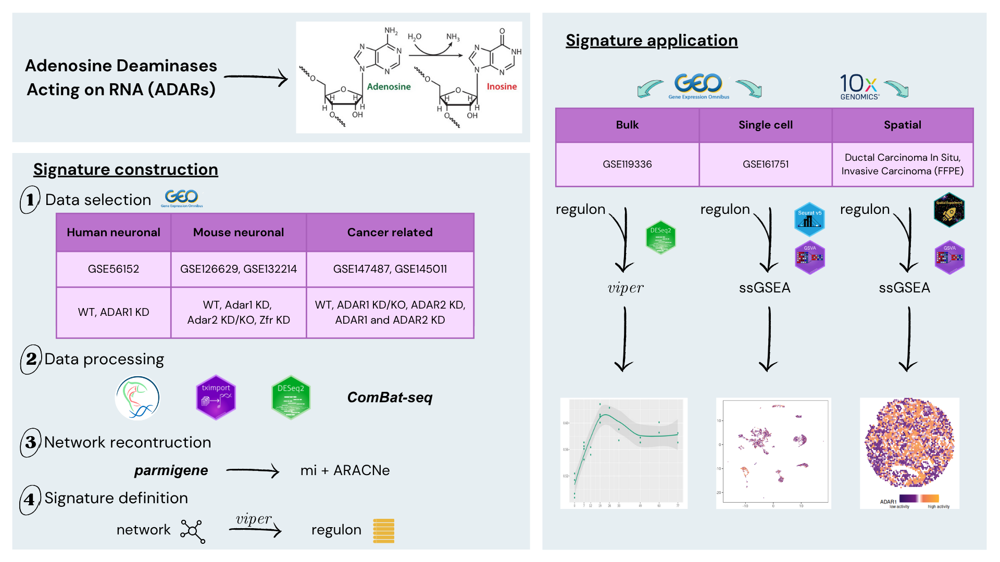

<!-- README.md is generated from README.Rmd. Please edit that file -->

```{r, include = FALSE}
knitr::opts_chunk$set(
    collapse = TRUE,
    comment = "#>",
    fig.path = "man/figures/README-",
    out.width = "100%"
)
```

# ADARcas

<!-- badges: start -->
<!-- badges: end -->

The goal of `ADARcas` is to provide some functions that allow the user to 
measure ADARs activity by using previously developed signatures, or by computing 
his own signature starting if a dataset with its reconstructed regulatory 
network is available. ADARs' activity will be represented by a Contextual
Activity Score (CAS), that is specific for human neuronal, mouse neuronal or
cancert contexts and can be computed starting from bulk, single-cell RNA-Seq or
spatial transcriptomic data.

<p align="center">

</p>

## Installation

The `ADARcas` package can be installed:

```{r}
if (!require("BiocManager", quietly = TRUE))
    install.packages("BiocManager")

BiocManager::install("CaluraLab/ADARcas")
```

## Development tools

* Continuous code testing is possible thanks to [GitHub actions](https://www.tidyverse.org/blog/2020/04/usethis-1-6-0/)  through `r BiocStyle::CRANpkg('usethis')`, `r BiocStyle::CRANpkg('remotes')`, and `r BiocStyle::CRANpkg('rcmdcheck')` customized to use [Bioconductor's docker containers](https://www.bioconductor.org/help/docker/) and `r BiocStyle::Biocpkg('BiocCheck')`.
* Code coverage assessment is possible thanks to [codecov](https://codecov.io/gh) and `r BiocStyle::CRANpkg('covr')`.
* The code is styled automatically thanks to `r BiocStyle::CRANpkg('styler')`.
* The documentation is formatted thanks to `r BiocStyle::CRANpkg('devtools')` and `r BiocStyle::CRANpkg('roxygen2')`.

For more details, check the `dev` directory.

This package was developed using `r BiocStyle::Biocpkg('biocthis')`.
