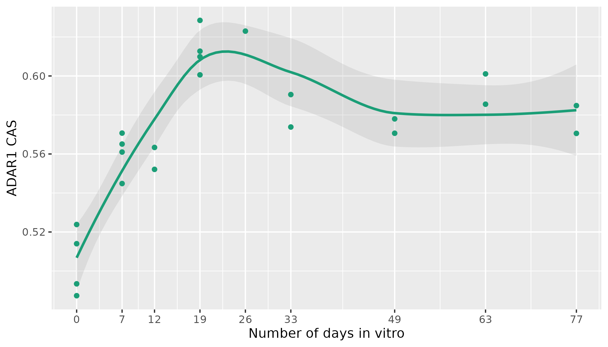
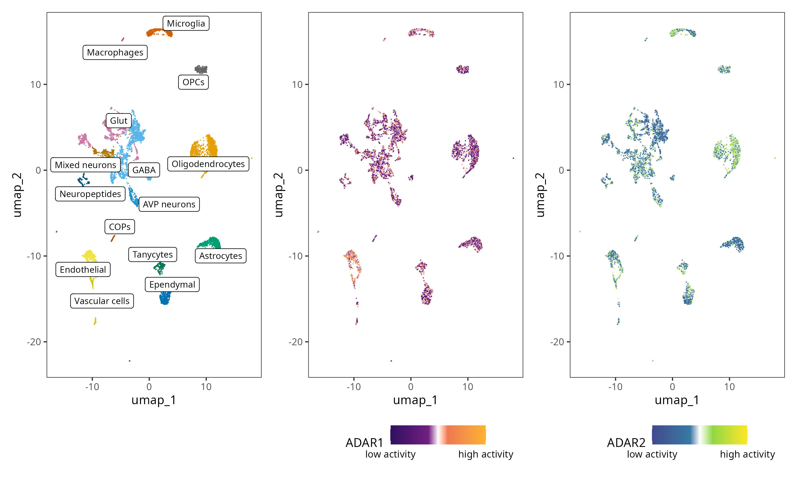
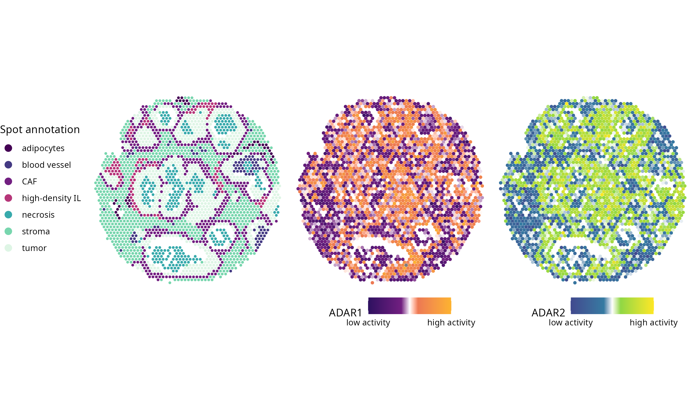

```{r setup, include = FALSE}
knitr::opts_chunk$set(
    collapse = TRUE,
    comment = "#>",
    crop = NULL ## Related to https://stat.ethz.ch/pipermail/bioc-devel/2020-April/016656.html
)
```


# Introduction

The conversion of adenosine to inosine is the predominant form of RNA editing in the animal kingdom and it is catalyzed by Adenosine Deaminases Acting on RNA (ADARs). This modification occurs in double-stranded RNA molecules and affects many phisiological and pathological processes, such as neuronal development and cancer. Hence, measuring ADAR activity is fundamental to deepen its functional role in different cellular contexts.

To this end, we developed a method based on transcriptional signatures derived from RNA-Seq datasets with the knockout (or knockdown) of ADAR1, ADAR2, or both. 
Specifically, we obtained three signatures to take into account the fact that ADARs activity shows a significant variation across tissues, cell types and conditions. The signatures were computed by virtual inference of protein activity by enriched regulon analysis and were derived from contexts where ADARs activity is known to be relevant: neuronal, mouse neuronal and cancer-related.

ADARcas provides a fast way to infer ADAR activity on the basis of the approach we described above. ADARcas functions take as input bulk, single-cell, or spatial transcriptomic data, returning a Contextual Activity Score (CAS) at the single sample, cell or spot level. 


# How to use ADARcas


## Installation

To install the package:

```{r, message=FALSE}
if (!require("remotes", quietly = TRUE))
    install.packages("remotes")

remotes::install_github("CaluraLab/ADARcas")
```


## Libraries loading

```{r}
library(ADARcas)
library(ggplot2)
```


## Input data

When using the already available signatures - with the functions `neuronalSignature`, `neuronalMmSignature` and `tumoralSignature` - the input dataset must be a normalized RNA-Seq counts of bulk, single-cell or spatial transcriptomic data.
For bulk it must be provided as a numerical matrix with genes as rows and samples as columns. The output is a new matrix with ADAR CAS for each sample. Instead, for single-cell and spatial it can be either a `Seurat object` or a `SummarizedExperiment` (`SingleCellExperiment`/`SpatialExperiment`), which will be updated with ADAR CAS for each cell or spot as new metadata columns.

Otherwise, the function `yourSignature` can be used to compute a signature specific for the input data, if the regulatory network reconstructed from the expression data is available.

Gene IDs in the input data must be gene symbols. 


## Compute ADAR CAS with the neuronal signature

The human neuronal signature was obtained from the dataset with GEO accession number GSE56152. The dataset was derived from human embryonic stem cells, differentiated into frontal cortex neurons and motor neurons, half of which are characterized by ADAR1 knockdown.
The `neuronalSignature` function takes as input a normalized RNA-Seq counts dataset as described above and it is suitable for human neuronal contexts.

As an example, we computed ADAR1 CAS in a bulk dataset of human cerebral cortex starting from 23 hESCs, covering the stages of corticogenesis from 0 to 77 days (GEO accession number GSE56796). We run the command `neuronalSignature` by setting `object = "bulk"`. The results show an overall increase of ADAR1 activity in time, with a peak between day 19 and 26.

```{r, echo=FALSE, out.width = "100%"}

# 
```


## Compute ADAR CAS with the mouse-specific neuronal signature

The mouse neuronal signature was derived by combining data from mouse primary neurons with Adar1, Adar2 and Zfr knockdowns and from mouse brains with Adar2 knockouts (GEO accession numbers: GSE126629 and GSE132214). The `neuronalMmSignature` function takes as input a normalized RNA-Seq counts dataset as described above and it is suitable for mouse neuronal contexts.

In this case, we show an example with a single-cell RNA-Seq dataset (GEO accession number: GSE161751) with two PVN samples of mice. We computed ADAR1 and ADAR2 CAS with command `neuronalMmSignature` setting `object = "eset"`. 

```{r, echo=FALSE, out.width = "100%"}

# 
```


## Compute ADAR CAS with the cancer-related signature

The cancer-related signature was obtained using A549 cell line datasets (GEO accession numbers: GSE147487 and GSE145011), with the knockout (or knockdown) of ADAR1, ADAR2 of both.
The `tumoralSignature` function takes as input a normalized RNA-Seq counts dataset as described above and it is suitable for cancer contexts.

Here we show the results obtained on the spatial transcriptomic dataset “Human Breast Cancer: Ductal Carcinoma In Situ, Invasive Carcinoma (FFPE)”, from the 10x Genomics Visium Spatial Gene Expression data (https://www.10xgenomics.com). The manual annotation of the spots was retrieved from Pirrotta et al, 2024, NAR Genomics and Bioinformatics, "Exploring public cancer gene expression signatures across bulk, single-cell and spatial transcriptomics data with signifinder Bioconductor package". We computed CAS with command `tumoralSignature` setting `object = "eset"`. Both the activities of ADAR1 and ADAR2 resulted higher in the tumoral spots as shown in the figure.

```{r, echo=FALSE, out.width = "100%"}

# 
```


## Compute ADAR CAS with the dataset-specific regulon

The package `ADARcas` also offers the function `yourSignature`, that allows to compute a signature specific for the dataset for which we want to obtain ADARs' activity scores. This can be done when, in addition to the expression matrix, the reconstructed network is also available. The expression matrix must be provided via the argument `mat =` and the corresponding network via the argument `net =`. Also, the function needs to take as argument the origin organism between H. sapiens and M. musculus as `hsapiens` or `mmusculus` in the argument `organism =`.

In this example we used the normalized expression matrix relative to the dataset with GEO accession number GSE56152, which comprises 12 samples of human embryonic stem cells (hESC h9) differentiated to forebrain and motor neurons. RNA was collected at different time points (day 0, 10, 17 and 35) and half of the samples underwent the knockdown of ADAR1. We had previously obtained the gene regulatory network reconstructed with the R package `parmigene` to estimate the mutual information, and then by using the additive model of ARACNe (Margolin et al, 2006, BMC Bioinformatics) to obtain a square-weighted adjacency matrix. However, with example purpose, the derived network was filtered to keep only 50 genes, included those of interest (i.e. ADAR and ADARB1). 

In the figure are shown the results obtained by running the command `yourSignature` setting `organism = "hsapiens"`. As expected, ADAR1 CASs are higher in the WT samples than in the KD ones. 

```{r}
# Load the example data
data(example_network)
data(matrix)

# Infer ADAR activity
res <- yourSignature(mat = matrix, net = example_network, organism = "hsapiens")

# Visualize the results
res_df <- data.frame(treatment = c(paste(rep("WT day", 6), 
                                         c("0", "10", "17", "17", "35", "35"),
                                         c("_1", "_1", "_1", "_2", "_1", "_2")), 
                                   paste(rep("ADAR KD day", 6), 
                                         c("0", "10", "17", "17", "35", "35"),
                                         c("_1", "_1", "_1", "_2", "_1", "_2"))),
                     adar1_cas = res["ADAR", ],
                     score = rep("ADAR1 CAS", 12))

ggplot(res_df, aes(x=treatment, y= score, fill = adar1_cas)) +
  geom_tile() +
  theme(axis.text.x = element_text(vjust = 0.5, hjust = 1, angle = 90)) +
  scale_fill_gradient(low = "white", high = "red") +
  labs(y = NULL, x = NULL, fill = "CAS") +
  scale_x_discrete(labels = c("KD day 0", "KD day 10", "KD day 17", 
                              "KD day 17", "KD day 35", "KD day 35",
                              "WT day 0", "WT day 10", "WT day 17", 
                              "WT day 17", "WT day 35", "WT day 35")) +
  theme(legend.position = c("right"),
        legend.text = element_text(size = 8), 
        legend.title = element_text(size = 10),
        legend.key.size = unit(0.8, "cm"), 
        legend.key.height = unit(0.4, "cm")) +
  coord_fixed()
```


## Visualization

### Boxplot visualization of ADAR CAS

The function `CASboxplots` allows to visualize the distribution of the score across different groups of interest (e.g. cluster, condition, treatment). It takes as `data` a `SummarizedExperiment` or a `Seurat` object updated by the other functions of the package with the ADAR activity scores stored in the metadata. The categories to be visualized on the x-axis can be set via the argument `by =`, and the variable to use for coloring the boxplots via the argument `color =`. Also, the argument `adar =` is needed to specify which CAS to visualize between ADAR1 and ADAR2. 

### Dimensional visualization of ADAR CAS

The function `CASdittoplot` allows to visualize ADAR CAS as a `dittoDimPlot` of the R package `dittoSeq`. It takes as `data` a `SummarizedExperiment` or a `Seurat` object updated by the other functions of the package with the ADAR activity scores stored in the metadata. You can set the dimensionality reduction type to visualize via the argument `reduction =`. Also, the argument `adar =` is needed to specify which CAS to visualize between ADAR1 and ADAR2. 
